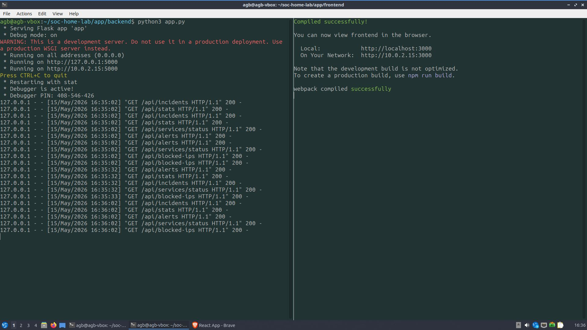
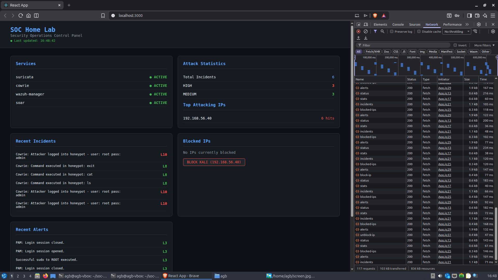

# SOC Home Lab

A fully functional Security Operations Centre home lab built from scratch,
featuring automated threat detection, honeypot deception, SIEM correlation,
custom SOAR automation, and a full stack management dashboard.

---

## Architecture

```text
Kali Linux (Attacker)       Lubuntu VM (Defender)
192.168.56.40               192.168.56.12
                                    │
                          ┌─────────┴──────────┐
                          │                    │
                    Suricata IDS          Cowrie Honeypot
                    (Network IDS)         (SSH Honeypot)
                          │                    │
                          └─────────┬──────────┘
                                    │
                               Wazuh SIEM
                            (Log Correlation)
                                    │
                            Python SOAR Engine
                           (Automated Response)
                                    │
                          SOC Control Panel
                         (React + Flask Dashboard)
```

---

## Components

### Phase 1 — Suricata IDS
- Version: 7.0.3
- Monitors network interface enp0s8
- ET Open ruleset with 49,975 detection rules
- Detects port scans, exploit attempts, malicious traffic
- Outputs alerts to EVE JSON format for Wazuh ingestion

### Phase 2 — Cowrie SSH Honeypot
- Version: 2.9.19
- Simulates a real SSH server (fake hostname: webserver01)
- Captures attacker credentials, commands, and file downloads
- iptables redirect: port 22 → 2222 (transparent to attacker)
- Full session logging in JSON format

### Phase 3 — Wazuh SIEM
- Version: 4.11.2
- Ingests 5 log sources: Suricata, Cowrie, Apache, Auth, dpkg
- Custom detection rules for Cowrie honeypot events
- Real time alerting with severity levels 1-15
- Custom SOC dashboard with 5 monitoring panels

### Phase 3b — Python SOAR Engine
- Custom built from scratch in Python 3.12
- Tails Wazuh alerts.json in real time
- Auto blocks attacking IPs via iptables on level 10+ alerts
- Cross source correlation: detects same IP in Suricata + Cowrie
- SQLite incident database for audit trail
- Whitelist support to protect trusted IPs

### Phase 4 — SOC Control Panel
- React frontend + Flask backend
- 9 REST API endpoints
- 5 live dashboard panels
- Real time data from all security components
- One click IP blocking and unblocking
- Auto refreshes every 30 seconds

---

## Tech Stack

| Layer | Technology |
|---|---|
| Network IDS | Suricata 7.0.3 |
| Honeypot | Cowrie 2.9.19 |
| SIEM | Wazuh 4.11.2 |
| SOAR | Python 3.12 |
| Backend API | Flask |
| Frontend | React |
| Database | SQLite |
| Firewall | iptables |
| OS | Ubuntu 24.04 |

---

## Detection Pipeline

```text
Attack happens
       │
       ▼
Suricata detects network anomaly
       │
       ▼
Cowrie captures SSH session + credentials
       │
       ▼
Both write to JSON logs
       │
       ▼
Wazuh ingests and correlates
       │
       ▼
SOAR reads Wazuh alerts
       │
       ▼
SOAR blocks IP + logs incident
       │
       ▼
Dashboard shows everything live
```

---

## Project Structure

```text
soc-home-lab/
├── README.md
├── soar/
│   ├── main.py
│   ├── config.py
│   ├── requirements.txt
│   └── playbooks/
│       ├── ip_blocker.py
│       ├── correlator.py
│       └── incident_logger.py
├── wazuh/
│   └── cowrie_rules.xml
└── app/
    ├── backend/
    │   └── app.py
    └── frontend/
        └── src/
            ├── App.js
            └── App.css
```

---

## Key Results

- Suricata detecting Kali nmap scans ✅
- Cowrie capturing SSH sessions with credentials ✅
- Wazuh ingesting all 5 log sources ✅
- Custom Cowrie detection rules firing ✅
- SOAR auto blocking attacking IP ✅
- SOAR correlation alert firing ✅
- Incidents written to SQLite ✅
- Dashboard showing live data ✅
- End to end attack detection pipeline ✅
## Dashboard Screenshots

### Backend & Frontend servers


### Full Panel View


---

## Author

Built by CyberTheatriX as a practical demonstration of SOC engineering skills.
